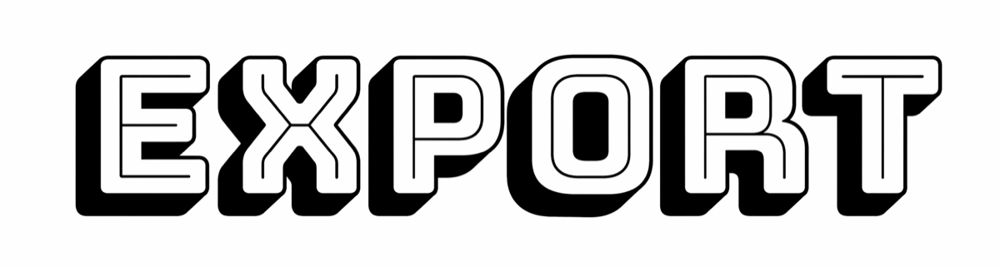

<div align="center">

  

  <p><strong>Export Codex sessions as clean, LLM-ready Markdown.</strong></p>

  <p>
    📄 English |
    📄 <a href="README_zh.md">简体中文</a>
  </p>

  <p>
    
    
    
  </p>

</div>

`export` is a Codex Skill for turning local Codex session history into a readable Markdown transcript. It gives Codex users a `/export`-style workflow today, while keeping the normal user surface inside Codex: install the Skill once, then invoke `$export` in conversation.

## Installation

```bash
npx skills add GaoSSR/codex-export-skill --agent codex -g -y --copy
```

Restart Codex after installation so the `$export` trigger is discovered.

To inspect the available Skill before installing:

```bash
npx skills add GaoSSR/codex-export-skill --list
```

## Quick Start

Inside Codex, ask:

```text
$export export the current session to Markdown
```

The Skill writes the transcript to `codex-session-exports/` under the active workspace and replies with the absolute file path plus a short export summary.

More examples:

```text
$export list recent Codex sessions
$export export session <session-id> to Markdown
$export export this session with tool logs
```

No extra shell commands are required after installation.

## Why

Session export is useful when you want another model pass to review how a conversation went, identify repeated mistakes, and turn those lessons into durable project rules such as `AGENTS.md`.

Claude Code already gives users a `/export` command for this workflow. This Skill keeps the same mental model in Codex by using `$export`, so users coming from Claude Code can migrate without learning a new command pattern or carrying extra naming overhead.

Markdown is the default output because LLM conversations already use Markdown heavily. The exported transcript is easy to read, diff, archive, and feed back into another model for analysis.

## Features

- **One-command installation**: install as a Codex Skill with `npx skills add`.
- **Conversation-native usage**: use `$export` directly inside Codex after installation.
- **Markdown-first output**: produces clean transcripts designed for humans and LLMs.
- **Current-session selection**: prefers the active Codex conversation when available.
- **Workspace-aware fallback**: falls back to the latest session for the current workspace, then latest globally.
- **Privacy-conscious defaults**: excludes system prompts, developer instructions, AGENTS context injection, environment context injection, reasoning records, and tool logs by default.
- **Optional tool-log export**: include tool logs only when you explicitly ask for them.

## Safety Boundaries

By default, the export includes:

- visible user messages
- visible assistant messages
- session metadata such as session id, source file, cwd, timestamps, originator, and CLI version

By default, the export excludes:

- system prompts
- developer instructions
- AGENTS or project-doc context injection
- environment context injection
- encrypted or summarized reasoning records
- tool calls and command output

Tool calls and command output are exported only when you explicitly ask the Skill to include tool logs.

## Session Selection

When you do not specify a session, the Skill tries to export the current Codex conversation first. If the current conversation id is unavailable, it falls back to the latest session recorded for the active workspace, then to the latest session globally.

To export a specific session, ask by session id:

```text
$export export session <session-id> to Markdown
```

## Roadmap

The long-term target is native Codex CLI support for `/export`, with Markdown as the default transcript format. This repository keeps the workflow usable as a Skill until native support is available upstream.

## Contributing

Issues and pull requests are welcome. Please keep changes aligned with the core contract: a simple Codex Skill surface, Markdown-first output, and conservative privacy defaults.

## License

Licensed under the [Apache License 2.0](LICENSE).

This is not an official OpenAI project.
