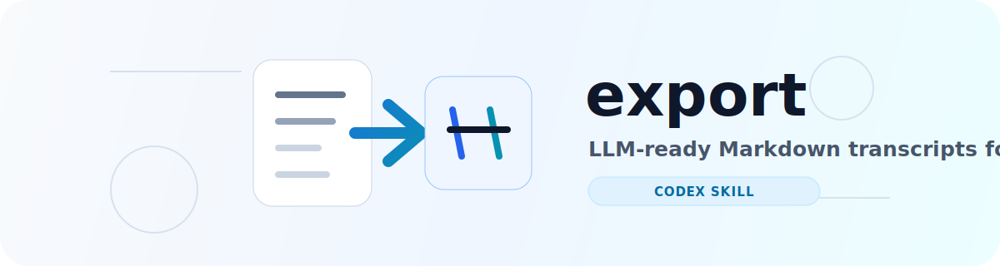

<div align="center">

  <picture>
    <source media="(prefers-color-scheme: dark)" srcset="assets/headerDark.svg" />
    
  </picture>

  <p><strong>将 Codex 会话导出为干净、适合 LLM 再分析的 Markdown。</strong></p>

  <p>
    <a href="README.md">English</a> |
    简体中文
  </p>

  <p>
    <a href="#快速开始">快速开始</a> |
    <a href="#功能特性">功能特性</a> |
    <a href="#安全边界">安全边界</a> |
    <a href="#开源协议">开源协议</a>
  </p>

  <p>
    
    
    
  </p>

</div>

`export` 是一个 Codex Skill，用于把本地 Codex 会话历史导出为可读的 Markdown 转录稿。它为 Codex 用户提供接近 `/export` 的工作流，同时保持正常的 Skill 使用方式：安装一次，然后在 Codex 对话里直接调用 `$export`。

## 为什么需要它

导出会话的价值在于，你可以把完整交互过程交给另一个模型复盘，分析自己和模型在协作中反复出现的问题，再把这些经验沉淀成稳定的项目规则，例如 `AGENTS.md`。

默认导出 Markdown，是因为 LLM 的输入输出本身就大量使用 Markdown。导出的内容既适合人阅读、归档和 diff，也适合再次交给模型做分析。

## 功能特性

- **一条命令安装**：通过 `npx skills add` 安装为 Codex Skill。
- **对话内直接使用**：安装后在 Codex 中直接调用 `$export`。
- **Markdown 优先**：输出干净的 Markdown 转录稿，便于人和 LLM 阅读。
- **优先导出当前会话**：可用时优先选择当前 Codex conversation。
- **工作区感知回退**：当前会话 id 不可用时，回退到当前工作区最近会话，再回退到全局最近会话。
- **隐私友好的默认边界**：默认排除 system prompt、developer 指令、AGENTS 上下注入、环境上下文注入、reasoning 记录和工具日志。
- **可选工具日志**：只有你明确要求包含 tool logs 时，才会导出工具调用和命令输出。

## 安装

```bash
npx skills add GaoSSR/codex-export-skill --agent codex -g -y --copy
```

安装完成后重启 Codex，让 `$export` 触发词被重新发现。

如果想先查看仓库中可安装的 Skill：

```bash
npx skills add GaoSSR/codex-export-skill --list
```

## 快速开始

在 Codex 对话中输入：

```text
$export export the current session to Markdown
```

Skill 会把会话转录稿写入当前工作区下的 `codex-session-exports/`，并返回导出文件的绝对路径和简短摘要。

更多用法：

```text
$export list recent Codex sessions
$export export session <session-id> to Markdown
$export export this session with tool logs
```

安装完成后不需要再运行任何额外 shell 命令。

## 安全边界

默认导出内容包括：

- 可见的用户消息
- 可见的助手回复
- 会话元数据，例如 session id、source file、cwd、时间戳、originator 和 CLI version

默认不会导出：

- system prompt
- developer 指令
- AGENTS 或 project-doc 上下注入
- 环境上下文注入
- 加密或摘要形式的 reasoning 记录
- 工具调用和命令输出

只有你明确要求 Skill 包含 tool logs 时，工具调用和命令输出才会被导出。

## 会话选择

当你不指定 session id 时，Skill 会优先尝试导出当前 Codex 会话。如果当前会话 id 不可用，则回退到当前工作区最近的会话，再回退到全局最近会话。

如果要导出指定会话，可以在 Codex 中按 session id 指定：

```text
$export export session <session-id> to Markdown
```

## 路线图

长期目标是推动 Codex CLI 原生支持 `/export`，并以 Markdown 作为默认转录格式。在上游原生能力可用之前，本仓库以 Skill 的形式提供可用的过渡方案。

## 贡献

欢迎提交 Issue 和 Pull Request。请保持项目核心契约稳定：简单的 Codex Skill 使用入口、Markdown 优先输出，以及保守的隐私默认边界。

## 开源协议

本项目基于 [Apache License 2.0](LICENSE) 开源。

本项目不是 OpenAI 官方项目。
